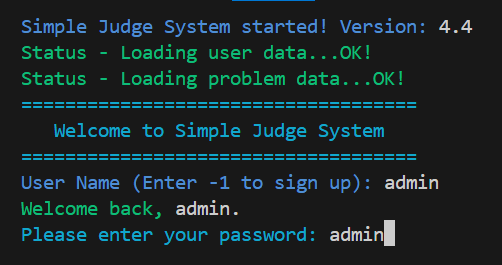
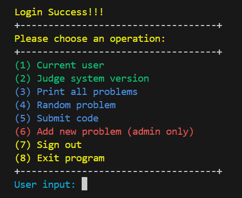
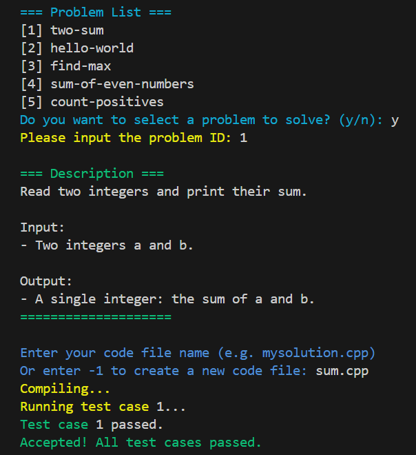

# Simple Judge System

A lightweight C++ judging system that supports account login, problem management, code compilation, and test case comparison.  
This project is an extended and refactored version of a classroom assignment, enhanced with a more complete interaction flow, structured file management, and cross-platform support.

> **Original Author (Teaching Assistant)**: Colten Chen  
> **Assignment Links**:  
>
> * [113-2 NCKU Program Design II Homework 3](https://hackmd.io/@L39Ai4MITOCY2Aioz54q2g/BytzQOz6Je#113-2-NCKU-Program-Design-II-Homework-3)  
> * [113-2 NCKU Program Design II Homework 5](https://hackmd.io/@L39Ai4MITOCY2Aioz54q2g/BJrQB3qzxl#113-2-NCKU-Program-Design-II-Homework-5)

---

## 📂 Project Structure

```
.
├── data/
│   ├── problem/
│   │   ├── <problem-name>/
│   │   │   ├── testcases/       # Test files (.in/.out)
│   │   │   ├── description.txt  # Problem description
│   │   └── problems.csv         # Problem metadata
│   ├── user/
│   │   ├── program/             # # User-submitted code
│   │   ├── user_output.txt      # Program output from user submission
│   │   ├── users.csv            # User account data
│
├── include/                     # All .hpp header files
│   ├── Account.hpp
│   ├── Problem.hpp
│   ├── Judge.hpp
│   ├── ColorPrint.hpp
│   └── Utils.hpp
│
├── src/                         # All .cpp source files
│   ├── Account.cpp
│   ├── Problem.cpp
│   ├── Judge.cpp
│   └── Utils.cpp
│
├── build/                       # Compiled executables
│   ├── judge\_system.exe
│   └── judge\_exec.exe
│
├── README.md
└── main.cpp
```

---

## ⚙️ Compilation

Use `g++` to compile:

```bash
# Create build directory
mkdir -p build

# Compile (single command)
g++ main.cpp src/*.cpp -I include -o build/judge_system -std=c++17

# Run
./build/judge_system
````

---

## 🚀 Features

### Login System

* Initialize account and problem system
* Support user login and management
* Admin account can add new problems

### Main Menu

1. View current user
2. Show system version
3. Display problem list and select a problem
4. Random problem selection
5. Submit code directly
6. Add new problem (admin only)
7. Logout
8. Exit system

### Judging Workflow

* Compile user-submitted C++ code
* Automatically test against problem test cases
* Compare output with expected results line by line
* Display result (Accepted / Wrong Answer / Runtime Error / Compile Error)

### Flow Diagrams

* Login Flow



* Main Menu Flow



* Code Submission Flow



---

## 🆕 Improvements & Enhancements

* **Modular File Structure**

  * Headers (`.hpp`) and sources (`.cpp`) fully separated into `include/` and `src/`
  * Added `build/` for compiled outputs
  * Each problem managed in `<problem-name>/` with description and test cases

* **Cross-Platform Support**

  * Conditional compilation with `#ifdef _WIN32` for Windows/Linux distinction
  * Auto-generate corresponding compile and run commands

* **Interactive Terminal Interface**

  * Added `ColorPrint` for colored and highlighted output
  * Loading animation and screen-clearing for smoother UX

* **Enhanced Problem Management**

  * Auto-generate problem folders, `description.txt`, and `testcases`
  * `problems.csv` updated instantly when a new problem is added

* **Improved Judging Workflow**

  * Auto-compile, execute, and test against multiple cases after submission
  * Display detailed results with error types

* **Refactored Codebase**

  * Reusable functions moved into `Utils` namespace
  * Reduced redundant loops for better efficiency and readability

* **Input Validation & Error Handling**

  * Verify input format and range
  * Retry loops to prevent crashes from invalid input

```


