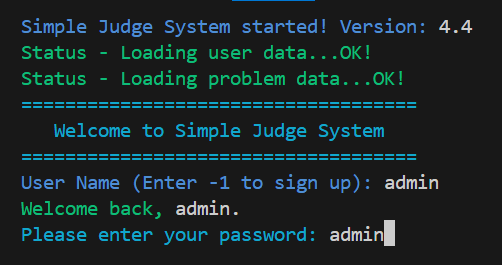
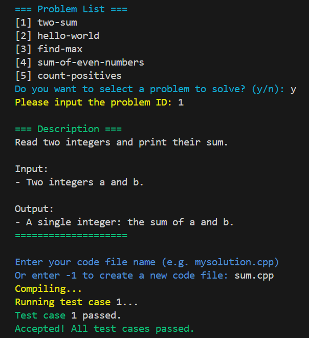

# Simple Judge System

一個簡易的 C++ 判題系統，支援帳號登入、題目管理、程式碼編譯與測資比對等功能。此專案為課堂作業的擴充改寫版本，加入了更完善的互動流程、檔案結構管理以及跨平台支援。

> **原作者 (課堂助教)**：Colten Chen
> **作業連結**：
>
> * [113-2 NCKU Program Design II Homework 3](https://hackmd.io/@L39Ai4MITOCY2Aioz54q2g/BytzQOz6Je#113-2-NCKU-Program-Design-II-Homework-3)
> * [113-2 NCKU Program Design II Homework 5](https://hackmd.io/@L39Ai4MITOCY2Aioz54q2g/BJrQB3qzxl#113-2-NCKU-Program-Design-II-Homework-5)

---

## 📂 檔案架構

```
.
├── data/
│   ├── problem/
│   │   ├── <problem-name>/        
│   │   │   ├── testcases/       # 測資檔案（.in/.out）
│   │   │   ├── description.txt  # 題目敘述
│   │   └── problems.csv         # 題目資訊
│   ├── user/
│   │   ├── program/             # 使用者提交的程式碼
│   │   ├── user_output.txt      # 使用者程式輸出
│   │   ├── users.csv            # 使用者帳號資料
│
├── include/                     # 所有 .hpp 檔案
│   ├── Account.hpp
│   ├── Problem.hpp
│   ├── Judge.hpp
│   ├── ColorPrint.hpp
│   └── Utils.hpp
│
├── src/                         # 所有 .cpp 檔案
│   ├── Account.cpp
│   ├── Problem.cpp
│   ├── Judge.cpp
│   └── Utils.cpp
│
├── build/                       # 編譯後檔案
│   ├── judge_system.exe
│   └── user_program.exe
│
├── README.md
└── main.cpp
```

---

## ⚙️ 編譯指令

使用 `g++` 編譯：

```bash
# 建立 build 資料夾
mkdir -p build

# 編譯（單指令）
g++ main.cpp src/*.cpp -I include -o build/judge_system -std=c++17

# 執行
./build/judge_system
```

---

## 🚀 功能介紹

### 系統登入

* 初始化帳號與題目系統
* 支援使用者登入與管理
* Admin 帳號可進行題目新增

### 主選單功能

1. 查看當前使用者
2. 顯示系統版本
3. 顯示題目列表並選擇作答
4. 隨機抽題
5. 直接提交程式碼
6. 新增題目（限 admin）
7. 登出
8. 離開系統

### 判題流程

* 編譯使用者提交的 C++ 程式
* 使用題目測資自動測試
* 與預期輸出逐行比對
* 顯示測試結果（Accepted / Wrong Answer / Runtime Error / Compile Error）

### 流程圖片

* 登入流程



* 主選單流程


* 程式上傳流程



---

## 🆕 創新與改進

* **模組化檔案結構**

  * 將 `.hpp` 與 `.cpp` 完全分離至 `include/` 與 `src/`
  * 增加 `build/` 作為編譯輸出位置
  * 新增題目敘述，並以 `<problem-name>/` 集中管理測資與敘述

* **跨平台支援**

  * 使用條件編譯 `#ifdef _WIN32` 區分 Windows 與 Linux 執行流程
  * 自動生成對應的編譯與執行指令

* **互動式終端介面**

  * 新增 `ColorPrint` 類別，支援彩色輸出與高亮
  * 加入 Loading 動畫與清屏功能，使用體驗更流暢

* **題目管理強化**

  * 自動建立題目資料夾、`description.txt` 與 `testcases`
  * 新增題目時會即時更新 `problems.csv`

* **判題流程優化**

  * 提交程式後自動編譯、執行並比對多組測資
  * 輸出詳細測試結果與錯誤類型

* **程式碼結構重構**

  * 把重複功能抽取至 `Utils` 命名空間
  * 減少冗餘迴圈呼叫，提升程式效率和可讀性

* **輸入檢查與錯誤防護**

  * 驗證使用者輸入格式與範圍
  * 迴圈重試避免非法輸入導致程式中斷

---

